# Path Finding

**Description:** This repository contains the short-project #2 and #3 of Artificial Intelligence course from Instituto Tecnológico de Costa Rica, imparted by the professor Juan Manuel Esquivel. The project consists on implement search algorithms to solve labyrinth problems. Specifically, we will solve a problem where a board introduced as a file have a rabbit and carrots. The rabbit, then will have to find a specified amount of carrots.

The project will be divided into two parts, both contained in a console program that will execute with different modes using differentiated flags. The first will consist
in developing a heuristic used within [A*](#a) to generically go over the board in
look for carrots. The second will consist of developing a [Genetic Algorithm](#genetic-algorithm) that will optimize the placement of directional signals so that the rabbit travel over the board.

### Content:

* [Installation](#installation)
* [Usage](#usage)
* [Board Representation](#board-representation)
* [Algorithms' Report](#models-report)
* [Unit Testing](#unit-testing)

## Installation:

Before using the project, first you have to install all the project dependencies.

* Python 3.4 or greater.

Now that all dependencies are installed. You can install the project using:

```pip install -U tec.ic.ia.pc2.g07.main```

Or you can clone the repository by:

```git clone https://github.com/mamemo/Path-finding.git```

## Usage:

When you have the directory with the repository, you have to search the repository on a console and execute the instruction:

```python -m tec.ic.ia.pc2.g07.main -h```

This will display all the flags that you can work with:

```
  -h, --help            show this help message and exit
  --a-estrella          A* Algorithm.
  --vision VISION       Vision field range.
  --zanahorias ZANAHORIAS
                        Objective's amount to search.
  --movimientos-pasados MOVIMIENTOS_PASADOS
                        Number of past movements to store. (Default 5)
  --genetico            Genetic Algorithm.
  --derecha             All individual going to the right.
  --izquierda           All individual going to the left.
  --arriba              All individual going up.
  --abajo               All individual going down.
  --individuos INDIVIDUOS
                        Individual's amount.
  --generaciones GENERACIONES
                        Generation's amount.
  --politica-cruce {random,sons_of_sons}
                        Crossover algorithm.
  --cantidad-padres CANTIDAD_PADRES
                        Number of parents.
  --tasa-mutacion TASA_MUTACION
                        Mutation Rate Percent.
  --tablero-inicial TABLERO_INICIAL
                        Input file destination. File containing the scenario
                        to be resolved.
```
Each algorithm uses different flags, but they have one in common, you can see the description next to the flag:

```
  --tablero-inicial TABLERO_INICIAL
                      Input file destination. File containing the scenario
                      to be resolved.
```

To run A* you will need:

```
  --a-estrella          A* Algorithm.
  --vision VISION       Vision field range.
  --zanahorias ZANAHORIAS
                        Objective's amount to search.
  --movimientos-pasados MOVIMIENTOS_PASADOS
                        Number of past movements to store. (Default 5)
```

To run Genetic Algorithm you will need:

```
  --genetico            Genetic Algorithm.
  --derecha             All individual going to the right.
  --izquierda           All individual going to the left.
  --arriba              All individual going up.
  --abajo               All individual going down.
  --individuos INDIVIDUOS
                        Individual's amount.
  --generaciones GENERACIONES
                        Generation's amount.
  --politica-cruce {random,sons_of_sons}
                        Crossover algorithm.
  --cantidad-padres CANTIDAD_PADRES
                        Number of parents.
  --tasa-mutacion TASA_MUTACION
                        Mutation Rate Percent.
```


## Board Representation:

The board will be a text file of N lines and M columns and each character can be only:

* C: capitalized, identifies the position of the rabbit. There can only be one per board.
* Z: capitalized, identifies the position of a carrot. There may be multiple carrots per board.
* Blank space: The space character does not have any side effects but it does must be present to indicate a position on the board by which the rabbit can transit.
* <: symbol for smaller than, indicates a change of direction to the left.
* \>: symbol for greater than, indicates a change of direction to the right.
* A: letter A capitalized, indicates a change of direction upwards.
* V: letter V capitalized, indicates a change of direction downwards.
* Change of line: It has no interpretation in the program other than separating different rows.

For further experiments we will use the following board:

<div style="text-align:center">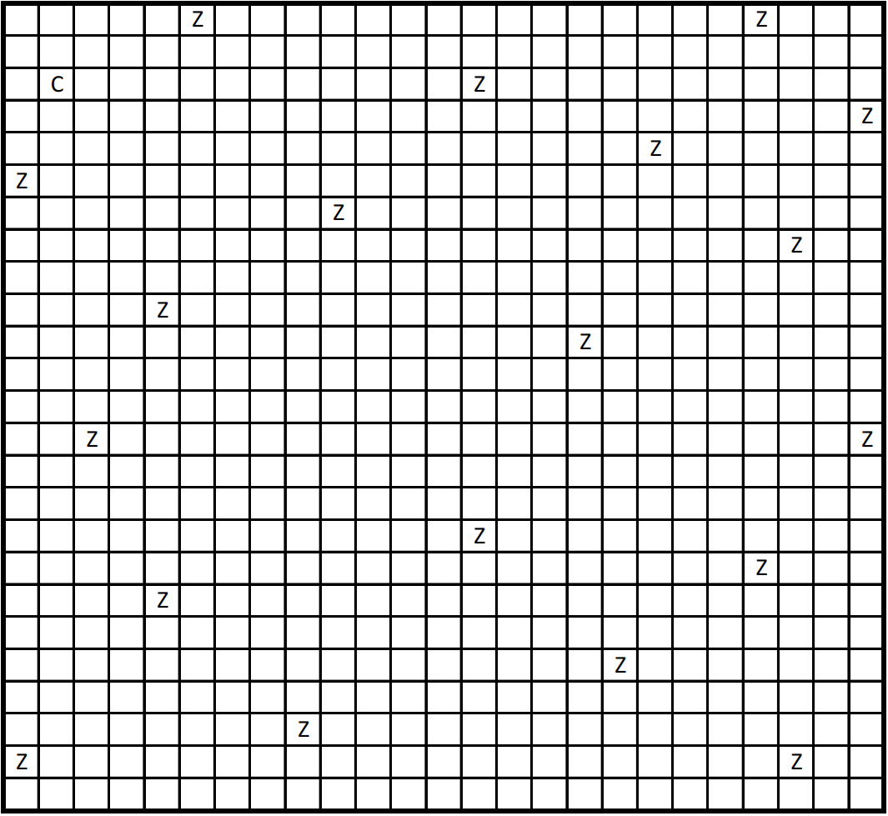</div>

## Algorithms' Report

This section contains the analysis of using each algorithm and how well it performs with different parameters. Every model is called from [main.py](../master/tec/ic/ia/pc2/g07/main.py) and the process is the following:
1. Waiting parameters.
2. Receiving parameters.
3. Creating the respectively algorithm.
3. Validate the flags.
4. Running the algorithm.
5. Generate output messages and files.

### A*

The main goal was to create a program that moves the rabbit through the board, a box at a time, using A\*. We had to design a cost function to guide the search A\* considering the accumulated cost and a heuristic to approximate the future cost. The accumulated cost up to a specific point in the execution of the algorithm will be simply the number of steps that the rabbit has given.

The future cost will be describe below, the elements that we had to consider was:
* The environment is not completely observable.
* The rabbit will have a range of vision. If the current state has the rabbit in the box (20,
18), for example, and the rabbit has a vision of two, may take into account the content of the boxes (18, 16) to the box (22, 20).
* The design of the heuristic should not include "memory" that makes the environment implicitly
observable. In particular, the algorithm should maintain the memory footprint equally for "big" and "little" search spaces.
* At the beginning of the program, it will be indicated how many carrots the rabbit should look for in total
to finish his work.

The function cost is defined as follows:

<div style="text-align:center">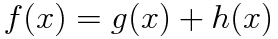</div>

we defined g(x) as:

<div style="text-align:center">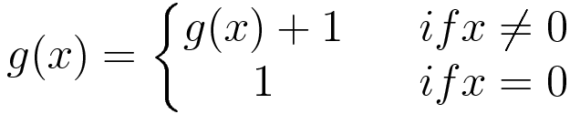</div>

where x stands for the number of steps taken.

Then we have the heuristic h(x) defined as:
<div style="text-align:center">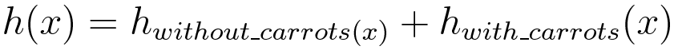</div>

We defined h_without_carrots(x) as the function of heuristic without considering the carrots in sight:

<div style="text-align:center">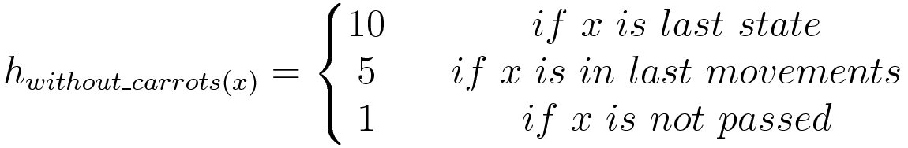</div>

where x is the possible state to move. Then the function considering the carrots is defined as the heuristic h_with_carrots(x):

<div style="text-align:center">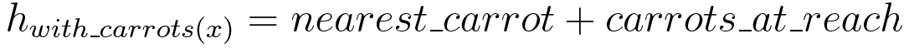</div>

The *nearest_carrot* part is the distance between the possible state and the nearest possible carrot. For example in:

<div style="text-align:center">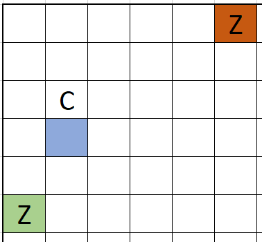</div>

For the tested next state **[3,1]**, the nearest carrot will be **[5,0]**; because abs(3-5)+abs(1-0) = **3** and for the other carrot in sight the distance is abs(3-0)+abs(1-5) = **7**.

The *carrots_at_reach* part is how many carrots are at reach if you move to the state. For example, the reach fields are presented in the next images:

<div style="text-align:center">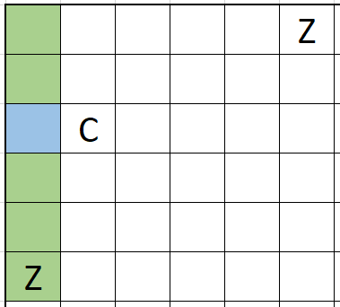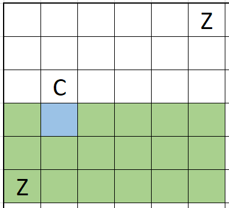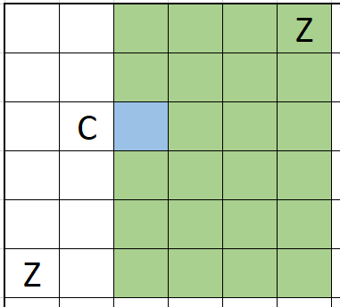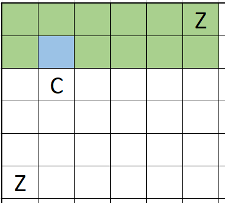</div>

where the results for the states [[2,0], [3,1], [2,2], [1,1]] would be **1**.

So, for summary, if we those two scenarios the costs are:

 <div style="text-align:center">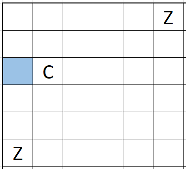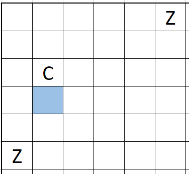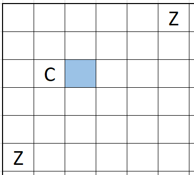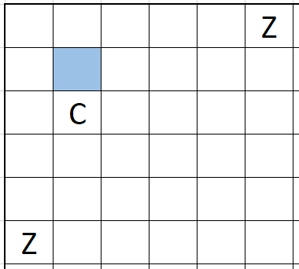</div>

 <div style="text-align:center">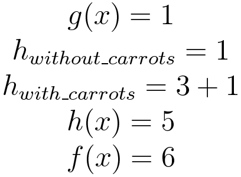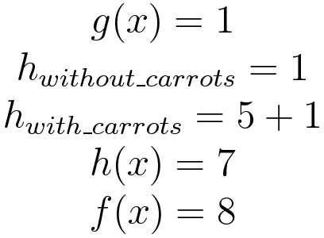</div>

 The best possible states are equally [2,0] and [3,1] with a cost of **6**. In these cases the next state is selected randomly.

Now, we will present the analysis of cost variation when carrots number and vision are changed. Every each of the following experiments are presented after 10 exexcutions. The value below is the mean of the cost. The board is presented above and it contains 25x25 boxes and 19 carrots. The commented code of this algorithm is in [A_Star.py](../master/tec/ic/ia/pc2/g07/algorithms/A_Star.py)

#### Variation in carrots number

<div style="text-align:center">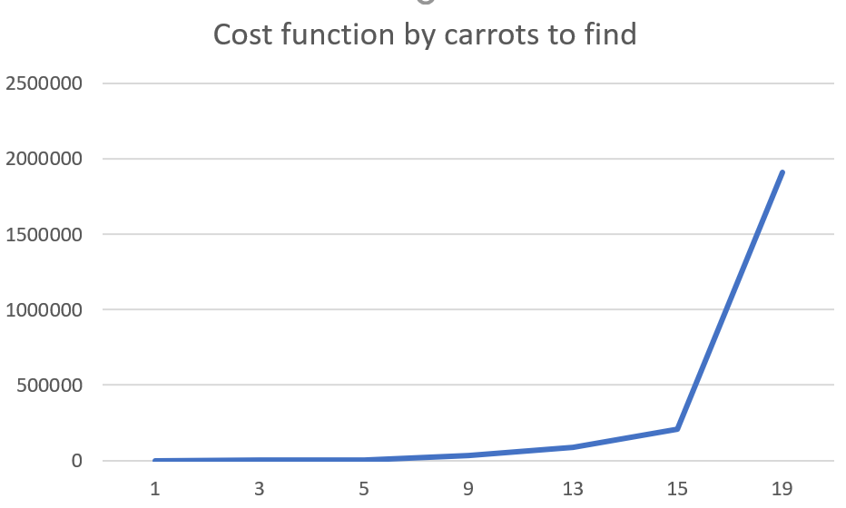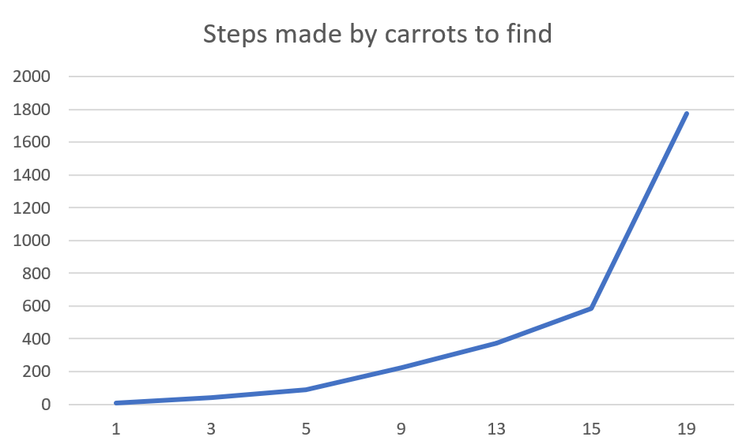</div>
> The vision field is 2.
<div style="text-align:center"><table>
    <tbody>
        <tr>
            <th>Carrots</th>
            <th>1</th>
            <th>3</th>
            <th>5</th>
            <th>9</th>
            <th>13</th>
            <th>15</th>
            <th>19</th>
        </tr>
        <tr>
            <th>Cost</th>
            <td>25.3</td>
            <td>929.5</td>
            <td>4707.5</td>
            <td>30697.7</td>
            <td>85406.3</td>
            <td>210162.4</td>
            <td>1911582.1</td>
        </tr>
        <tr>
            <th>Steps</th>
            <td>6.6</td>
            <td>41.6</td>
            <td>90.8</td>
            <td>225.7</td>
            <td>375.3</td>
            <td>587.5</td>
            <td>1776</td>
        </tr>
    </tbody>
</table></div>

* As we can see if the rabbit needs to find more carrots will have to move more around the board and the cost will grow.

#### Variation in vision field

<div style="text-align:center">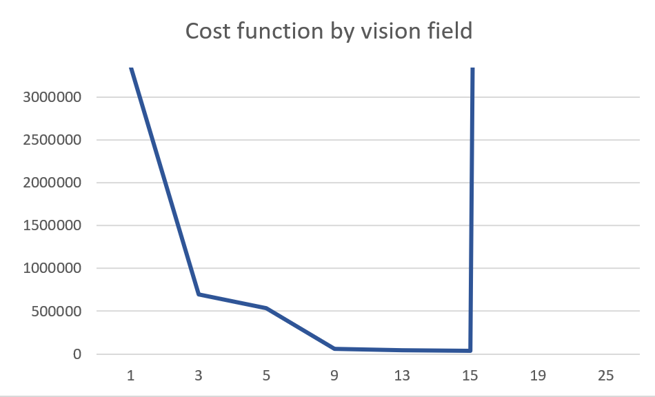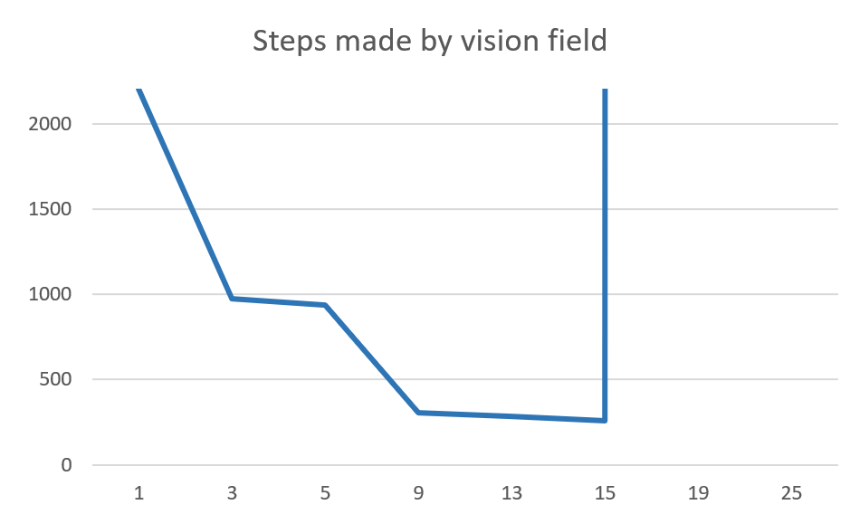</div>
> The carrots to find are all of them. (19)
<div style="text-align:center"><table>
    <tbody>
        <tr>
            <th>Carrots</th>
            <th>1</th>
            <th>3</th>
            <th>5</th>
            <th>9</th>
            <th>13</th>
            <th>15</th>
            <th>19</th>
            <th>25</th>
        </tr>
        <tr>
            <th>Cost</th>
            <td>3343809.3</td>
            <td>699767.4</td>
            <td>531807.1</td>
            <td>56611.2</td>
            <td>44365.3</td>
            <td>36510.9</td>
            <td>Inf</td>
            <td>Inf</td>
        </tr>
        <tr>
            <th>Steps</th>
            <td>2203.2</td>
            <td>973</td>
            <td>935</td>
            <td>304.4</td>
            <td>282.6</td>
            <td>257.4</td>
            <td>Inf</td>
            <td>Inf</td>
        </tr>
    </tbody>
</table></div>

* On vision field of 19 and 20, the rabbit gets in a loop so it will never stop, that's why in the chart we put it a Inf value.

* The loop is caused because the rabbit walk to a certain point where it approaches a carrot and another carrot see as a better approach and viceversa. So it moves in circles.

* As we can see when the vision field gets bigger the rabbit can do better decision, so it reduces the cost and steps. That tendency remains until a certain amount of vision field.


### Genetic Algorithm
